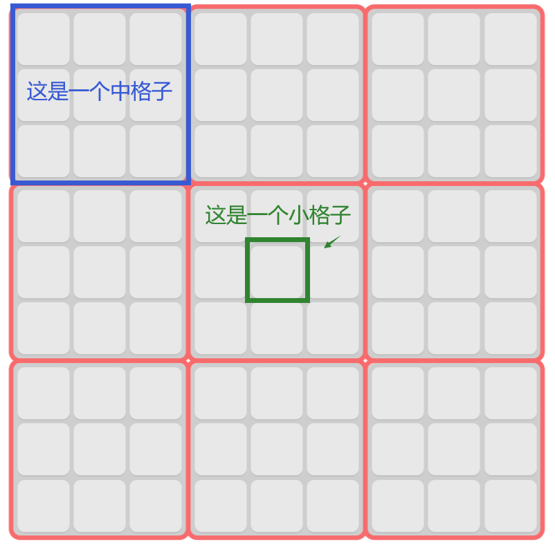
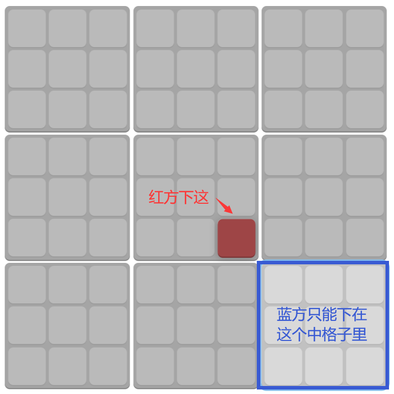
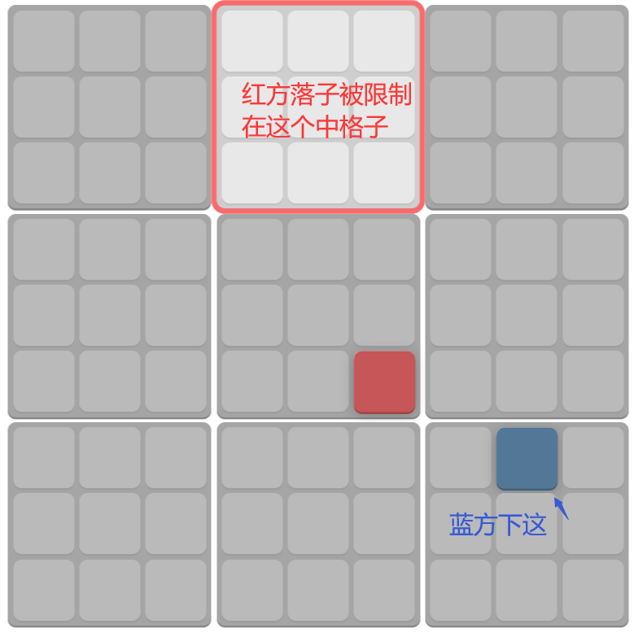
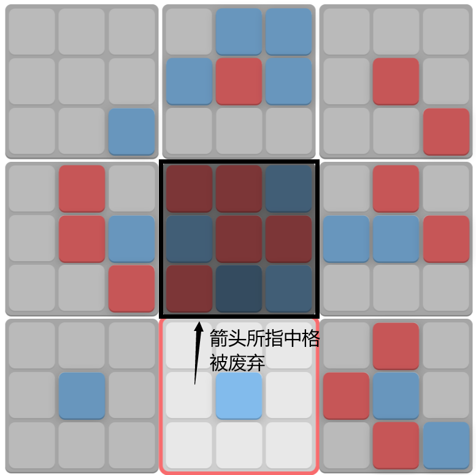
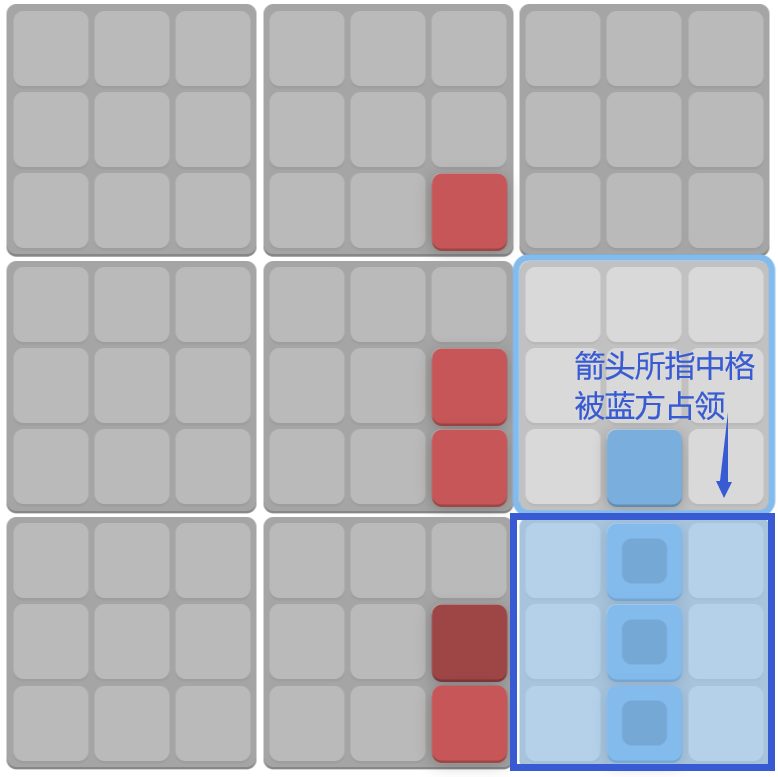
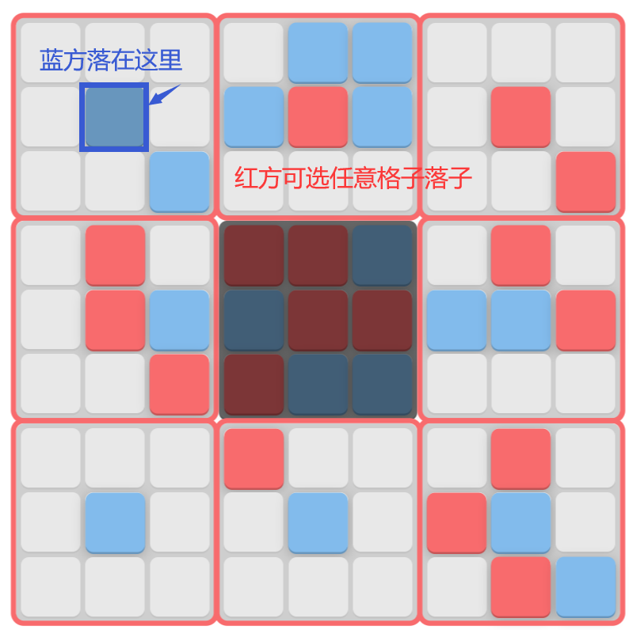
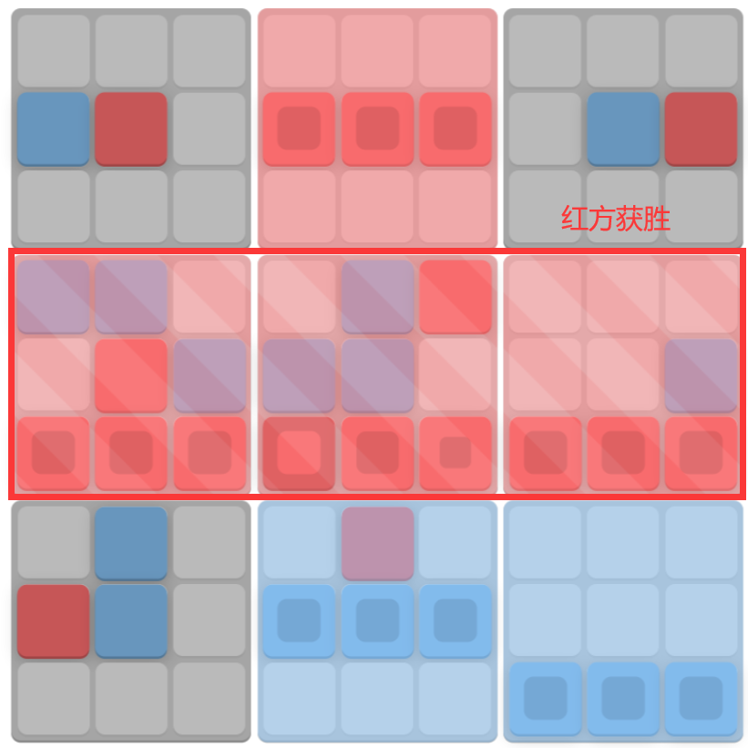
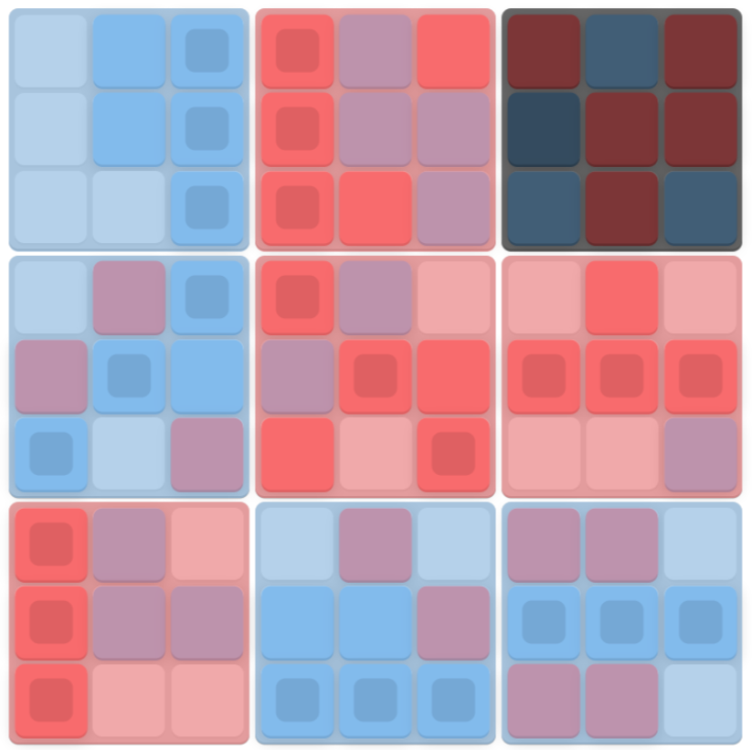

## 游戏规则
快速了解请点击->[tix.tax/#tutorial](https://tix.tax/#tutorial)

以下是详细规则：

1. 游戏在一个9\*9的大格子中进行，其中每3\*3个小格子构成一个中格子，如下图。
   
    

2. 玩家共两人，红方先手，蓝方后手，两人依次落子。

3. 开局时红方先在所有小格子中选择一个格子落子，红方的落子会限制蓝方落子位置。蓝方落子所在的中格子对应于大格子的位置必须和红方所下的小格子对应其中格子的位置相同。如下图，当红方下在中格子中的右下方小格子时，蓝方只能在与大格子相对应的右下中格子中落子。

    

4. 蓝方落子。蓝方的落子也会限制红方落子位置，如下图。
   
    

5. 两人重复步骤3、4，期间会遇到以下特殊规则：
    - 当一个中格子中有一方的棋子连成一条线（横着竖着或者对角线），则这整个中格子都被其占领，如下图。

        

    - 若一个中格子被下满了却无人占领（即没有哪一方的子能连成一条线），则该格子被废弃。如下图。

        

    - 当一个中格子被占领或废弃后，若再有一方被限制在此中格子，可以在其他任意格子落子，如下图。

        

6. 遇到以下情况游戏结束：

    - 当一方占领的中格子连成一条线时，则其获胜，如下图。

        

    - 九个中格都被占领或废弃，但无人胜出时，则平局，如下图。

        